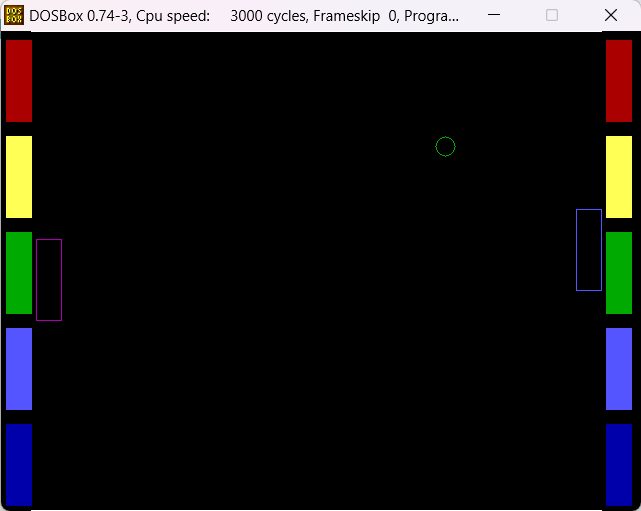

# 🎮 ATARI BREAKOUT COM PONG

## 📋 Descrição

Este jogo é uma reprodução e mistura dos consagrados jogos Breakout e Pong. O jogo é jogado em duplas e cada jogador tem o objetivo de evitar que a bolinha saia dos limites do seu campo. Além disso, cada jogador deverá proteger também suas paredes, que fornecerão proteção extra para a bolinha. Tudo isso ao mesmo tempo em que tenta quebrar as paredes do jogador adversário e fazer com que a bolinha saia pelo outro lado. Feito como atividade avaliativa da disciplina de Sistemas Embarcados I, da Universidade Federal do Espírito Santo.

<p align="center" style="display: flex; align-items: center; justify-content: center;">
  
</p>

## 🫂 Colaboradores

[Ana Tereza](https://github.com/atrsp)
<br>
[João Pedro](https://github.com/joaoBatista04)
<br>
[Vitor](https://github.com/vitordcgomes)

## 📂 Estrutura de Arquivos

- `caracter.asm`, `circle.asm`, `cursor.asm`, `frect.asm`, `line.asm`, `plot_xy.asm` - São arquivos do modo gráficos, plotam figuras na tela

- `delay.asm`, `dirxy.asm`, `lwalls.asm`, `raquete.asm`, `rwalls.asm` - São arquivos relacionados à mecânica do jogo. Incluem movimentação da bolinha, verificação de colisão com as paredes, limites e raquetes, movimentação das raquetes, delay entre chamadas de função, entre outras funcionalidades.

- `gameover.asm`, `intro.asm` - São os arquivos de menu, em que o jogador poderá definir a dificuldade da partida e outras opções, como reinício ou fim de partida.

- `main.asm` - É o arquivo principal do jogo, que contém as variáveis e o link entre todos os demais arquivos.

## 👩‍💻 Como Compilar

1. Clone o repositório ou extraia o arquivo .zip:
   ```sh
   git clone https://github.com/seu-usuario/seu-repositorio.git

2. Abra o DOSBox no diretório onde estão os arquivos do jogo
    ```sh
    cd breakout

3. Compile os códigos utilizando o utilitário Make, que chamará o compilador Nasm e o linker Freelink. A compilação levará alguns instantes.
    ```sh
    make

4. Execute o jogo e divirta-se!
    ```sh
    main.exe

## 🎲 Como Jogar

Selecione a dificuldade do jogo entre fácil, médio e difícil, navegando pelas opções por meio das `setas para cima (↑) e para baixo (↓)` do teclado. Seleciona a dificuldade escolhida pressionando a tecla `Enter`. O jogo então terá início.

<br>

O jogador 1 controla a raquete de cor magenta, utilizando as teclas `W` e `S`. O jogador 2 controla a raquete de cor azul, utilizando as `setas para cima (↑) e para baixo (↓)`.

<br>

O jogo pode ser pausado a qualquer momento pressionando-se a tecla `P`. Para retomar o jogo, basta apertar novamente a mesma tecla. O jogo também poderá ser encerrado a qualquer momento, pressionando-se a tecla `Q`. Um menu aparecerá questionando se o jogador realmente quer encerrar a partida. Pressione `Y` para encerrar e `N` se quiser continuar jogando.

<br>

Se a bolinha sair por algum dos limites laterais, uma mensagem de game over irá aparece junto com um menu de confirmação se os jogadores desejam iniciar uma nova partida ou encerrar o jogo. Pressione `Y` para dar restart ao jogo e `N` para encerrar.
